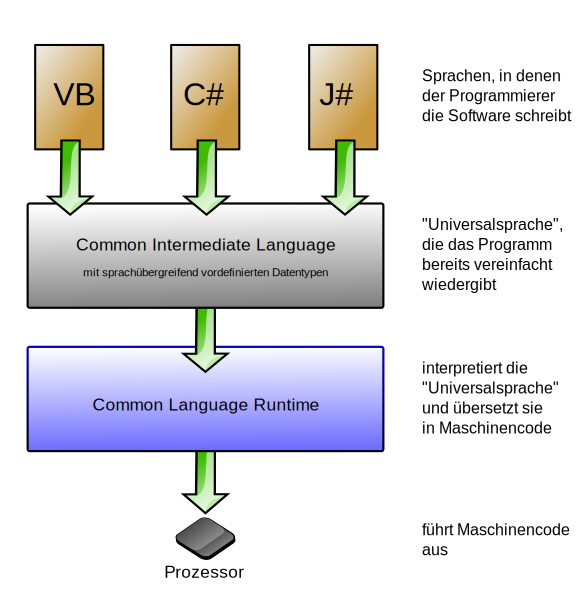

# Überblick über C#

**C# ist...**

- Objektorientiert
- komponentenorientierte

**Features:**

- **Garbage Collection:** Gibt automatisch Arbeitsspeicher zurück, der von nicht erreichbaren, nicht verwendeten Objekten belegt wird.
- **Nullable-Typen:** Bietet schutz vor Variablen, die nicht aud zugeordnete Objekte verweisen.
- **Ausnahmebehandlung**: bietet einen strukturierten und erweiterbaren Ansatz zur Fehlererkennung und Wiederherstellung.
- **Lambdaausdrückeunterstützen**
- **Language Integrated Query-Syntax (LINQ):** erstellt ein gängiges Muster für das Arbeiten mit Daten aus einer beliebigen Quelle
- **asynchrone Vorgänge**
- **einheitliches Typsystem**

# .NET-Architektur

Das .NET Framework bietet C#-Programmen sowohl eine **Laufzeitumgebung** **(Common Language Runtime (CLR))** für die Ausführung, als auch eine **Programmbibliothek** für die Entwicklung von Programmen.

**Ablauf:**

- C# Quellcode wird in eine Zwischensprache kompiliert
- Der IL-Code wird mit Ressourcen wie z.B. Bitmaps und Zeichenfolgen in einer Assembly gespeichert (.dll)

> Eine Assembly enthält ein Manifest, das Informationen über die Typen, die Version und die Kultur der Assembly bereitstellt.

> Die Kultur Klasse stellt kulturspezifische Informationen wie Sprache, Untersprache, Land/Region, Kalender und Konventionen für eine bestimmte Kultur zur Verfügung

**C#-Programm wird ausgeführt:**

- Assembly wird in die CLR geladen
- CLR konvertiert den IL-Code mithilfe der JIT-Kompilierung (Just-In-Time) in native Computeranweisungen

**Nice to know:**

> Der vom C#-Compiler erzeugte IL-Code entspricht dem allgemeinen Typsystem (CTS, Common Type Specification). Der über C# generierte IL-Code kann mit Code interagieren, der über die .NET-Versionen von F#, Visual Basic oder C++ generiert wurde. Eine einzelne Assembly kann mehrere Module enthalten, die in verschiedenen .NET-Sprachen geschrieben wurden. Die Typen können aufeinander verweisen, als wären sie in der gleichen Sprache geschrieben.

# Erster Schritt

- Hello.cs

[Quelle](https://docs.microsoft.com/de-de/dotnet/csharp/tour-of-csharp//)
